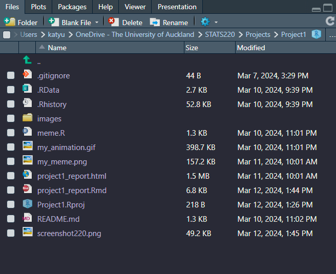

```{r setup, include=FALSE}
knitr::opts_chunk$set(echo=TRUE, message=FALSE, warning=FALSE, error=FALSE)
```

## Project requirements

I have created a [GitHub repo](https://github.com/mav-dbt/STATS220) for this course and for this project. I have also deployed the project using GitHub Pages, which [can be found here](https://mav-dbt.github.io/STATS220/project1_report.html) and used Git for version control. 

The required files, 

* project1_report.Rmd
* project1_report.html
* meme.R
* my_animation.gif
* my_meme.png
* Project1.Rproj

along with the image folder that contains images featured in the meme were created in RStudio and stored in a folder, Project1, on my computer. I used Git to pull the README.md file from GitHub into the folder, in order to make pushing the entire folder onto the main branch of the repo easier later on. All of these files have now been uploaded onto the GitHub repo, except for .gitignore, .RData, and .Rhistory.

A screenshot of the project folder from file explorer:


*Author's Note: Alternatively, a screenshot of the folder from RStudio is attached below (accessed via the toggle button). The files that got excluded when I pushed the folder onto the main branch of my GitHub repo are shown here.*

<script>
function toggleImage() {
    var img = document.getElementById("extraScreenshot");
    if (img.style.display === "none") {
        img.style.display = "block";
    } else {
        img.style.display = "none";
    }
}
</script>

<button onclick="toggleImage()">Show folder screenshot from RStudio!</button>



<br></br>


## My meme


The original 'This is Fine' meme:


*Author's Note: Apart from 'This is Fine', I was also inspired by [xkcd's Bobby Tables sketch](https://xkcd.com/327/).*

I re-created the 'This is Fine' meme with a slight twist to add a bit of story context before the final punchline. To do this, I removed the final 'This is Fine' panel and added 5 frames preceding it to lead into the story, giving it a 'comic-y' appearance keeping in spirit with the original meme, which was from a web comic. 

The first few frames were taken from ([this post from Docker](https://twitter.com/Docker/status/1457393936016805890)) and modified using Photoshop so that the dialogue is about an SQL injection (2nd frame specifically) before the iconic 'This is Fine' line and the image of the dog in a burning house.

```{r meme-code, eval=TRUE}
library(magick) # Imports the magick library

# Sets up the upper half of separator block
separator1 <- image_resize(image_read("images/its_not_fine.jpg"), "300 x 350")

# Creates a blank black rectangle, then add text to it positioned in the middle 
separator2 <- image_blank(height = 250, width = 300, color = "black") %>%
  image_annotate(text = "It was NOT",  gravity = "center", size = 45, color = "white")

# Appends the two separators to make a seperator block stacked on top of each other
separator = image_append(c(separator1, separator2), stack = TRUE)

# Sets up frames 1 - 4
frameOne <- image_resize(image_read("images/docker_1.jpg"), "300 x 350")
frameTwo <- image_resize(image_read("images/docker_2.png"), "300 x 350")
frameThree <- image_resize(image_read("images/docker_3.jpg"), "300 x 350")
frameFour <- image_resize(image_read("images/this_is_fine_final.png"), "300 x 350")

# Creates the meme by stacking frames and separator on top of each other
meme <- image_append(c(frameOne, frameTwo, frameOne, frameThree, separator, frameFour), stack = TRUE)

image_write(meme, "my_meme.png")
```


```{r animation-code, eval=FALSE}
library(magick) # Imports the magick library

# Sets up the upper half of separator block
separator1 <- image_resize(image_read("images/its_not_fine.jpg"), "300 x 350")

# Creates a blank black rectangle, then add text to it positioned in the middle 
separator2 <- image_blank(height = 250, width = 300, color = "black") %>%
  image_annotate(text = "It was NOT",  gravity = "center", size = 45, color = "white")

# Appends the two separators to make a seperator block stacked on top of each other
separator = image_append(c(separator1, separator2), stack = TRUE)

# Sets up frames 1 - 4
frameOne <- image_resize(image_read("images/docker_1.jpg"), "300 x 350")
frameTwo <- image_resize(image_read("images/docker_2.png"), "300 x 350")
frameThree <- image_resize(image_read("images/docker_3.jpg"), "300 x 350")
frameFour <- image_resize(image_read("images/this_is_fine_final.png"), "300 x 350")

# Creates the frame-by-frame animation with 0.5 FPS 
animation <- image_animate(c(frameOne, frameTwo, frameOne, frameThree, separator, frameFour), fps = 0.5)

image_write(animation, "my_animation.gif")
```

<br></br>


## Creativity

I used CSS to design a new completely layout (changing font family, colour, sizes, etc. - sorry, I'm a dark mode fan!) for the HTML project report and added a cursor/typewriting animation to the subtitle, as well as in-sync entry animation for the title and the author's section. 

As a play on the title I also modified 'Creating images with R' string into 'Creating images with', followed by the R logo to add a touch of visual to the header. 

I also incorporated aspects from xkcd's Bobby Tables/SQL injection sketch when creating my meme/GIF, giving them additional context, and used a function from the *magick* package that was not covered in the lectures/labs, image_resize(), to resize my images down to the desired size of 300px x 350px.

It's a tiny detail, but I've also injected some HTML (and technically, Javascript) to make a toggle button and to force a break between the sections!

```{html, EVAL=FALSE}
// Breaking up the sections
<br></br>
```

## Learning reflection

I learned the basic syntax of the R programming language and R Markdown from Module 1. R Markdown is particularly interesting to me because of its flexibility - how you can write with different programming languages within a R Markdown file and the code will still be interpreted as-is by the compiler, how you can also import packages/libraries in said languages (such as *magick* in R), and how you can knit the R Markdown file to output HTML, a Word doc, or even PowerPoint - and yet it's also very intuitive to write. 

This module was a gentle introduction to HTML/CSS/R, but I feel that it's a bit light on the data/statistics side of data technologies. The *magick* package is fun to meddle with, but *how is it used by people 'in the know' i.e. data scientists or engineers, professional statisticians, etc.?* That's the main thing I'd like to explore further regarding the content from Module 1.


```{css}

p {
  font-size: 18px;
}

.container-fluid, .main-container {
  padding: 0;
  margin: 0 auto;
  max-width: 90%;
}

#header {
  height: fit-content;
  padding: 0;
  background-image: url(https://upload.wikimedia.org/wikipedia/commons/c/c1/Rlogo.png);
  background-size: contains;
  background-repeat: no-repeat;
  background-position: right;
}

h1.title, .subtitle, .author {
  text-align: left;
  padding: 10px 0 10px 50px;
  font-family:'Trebuchet MS', 'Lucida Sans Unicode', 'Lucida Grande', 'Lucida Sans', Arial, sans-serif;
}

h1.title {
  font-size: 71px;
  padding: 200px 50px 0;
  font-weight: bold;
  animation: left-in 1.5s ease-in;
}

@keyframes left-in {
  from {
    opacity: 0%;
    transform: translateX(-100px);
  } to {
    opacity: 100%;
  }
}

h1.title, .author {
  color: #167aac;
}

.subtitle {
  width: fit-content;
  height: fit-content;
  font-size: 40px;
  color: #83c6e5;
  overflow: hidden;
  border-right: .10em solid #2596be;
  white-space: nowrap; 
  animation: 
    typing 1.5s steps(30, end),
    blinking .85s step-end infinite;
}

@keyframes typing {
  from { 
    width: 0;
  } to { 
    width: 500px;
  }
}

@keyframes blinking {
  from, to { 
      border-color: transparent; 
    } 50% { 
      border-color: #2596be; 
    }
}

.author {
  font-size: 25px;
  animation: right-in 1.5s ease-in;
}

@keyframes right-in {
  from {
    opacity: 0%;
    transform: translateX(100px);
  } to {
    opacity: 100%;
  }
}

body, pre {
  background-color: #1A1C1B;
}

pre {
  margin: 50px 150px;
  color: #fff;
  font-size: 14px;
}

.section, .level2 {
  color: #555D58;
  margin: 50px 50px 0;
}


img {
  display: block;
  margin: auto;
  max-width: 800px;
}

button {
  display: block;
  height: 50px;
  width: 400px;
  background-color: #1A1C1B;
}

```
