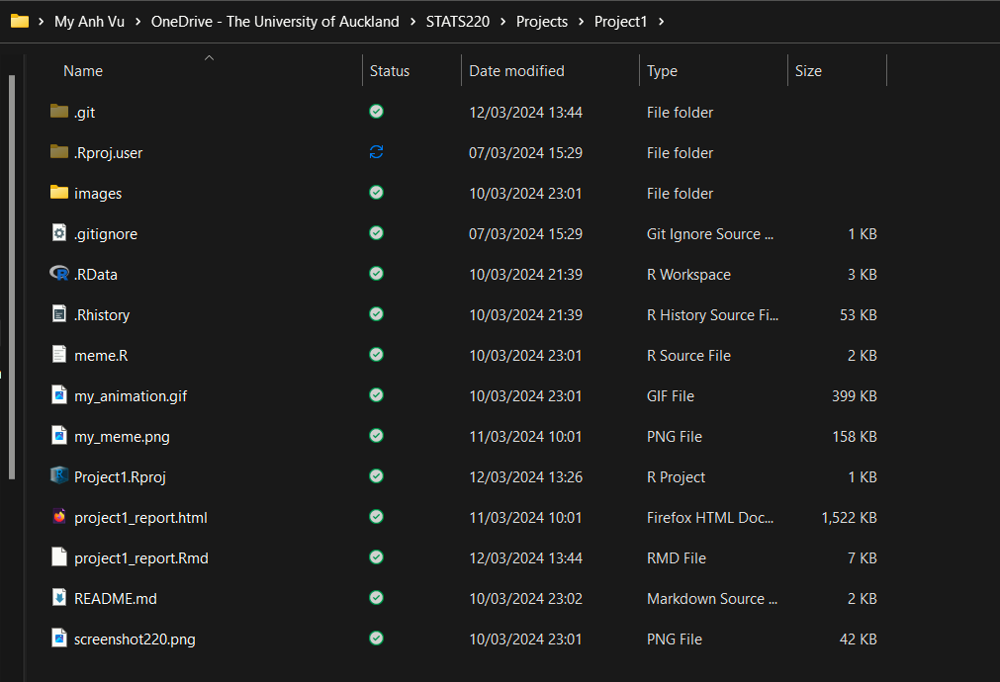
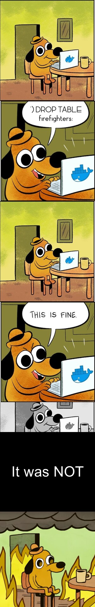
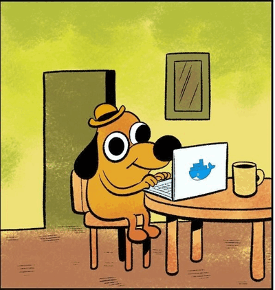

```{r setup, include=FALSE}
knitr::opts_chunk$set(echo=TRUE, message=FALSE, warning=FALSE, error=FALSE)
```

## Project requirements

I have created a [Github repo](https://github.com/mav-dbt/STATS220) for this course and for this project.



## My meme

*Note: Apart from 'This is Fine', I was also inspired by xkcd's Bobby Tables sketch.*


The original 'This is Fine' meme:


I re-created the 'This is Fine' meme with a slight twist to add a bit of story context before the final punchline. To do this, I removed the final 'This is Fine' panel and added 5 frames preceding it to lead into the story, giving it a 'comic-y' appearance keeping in spirit with the original meme, which was from a web comic. The first few frames were taken from ([this post from Docker](https://twitter.com/Docker/status/1457393936016805890)) and modified using Photoshop so that the dialogue is about an SQL injection (2nd frame specifically) before the iconic 'This is Fine' line and the image of the dog in a burning house.

```{r meme-code, eval=TRUE}
library(magick) # Imports the magick library

# Sets up the upper half of separator block
separator1 <- image_resize(image_read("images/its_not_fine.jpg"), "300 x 350")

# Creates a blank black rectangle, then add text to it positioned in the middle 
separator2 <- image_blank(height = 250, width = 300, color = "black") %>%
  image_annotate(text = "It was NOT",  gravity = "center", size = 45, color = "white")

# Appends the two separators to make a seperator block stacked on top of each other
separator = image_append(c(separator1, separator2), stack = TRUE)

# Sets up frames 1 - 4
frameOne <- image_resize(image_read("images/docker_1.jpg"), "300 x 350")
frameTwo <- image_resize(image_read("images/docker_2.png"), "300 x 350")
frameThree <- image_resize(image_read("images/docker_3.jpg"), "300 x 350")
frameFour <- image_resize(image_read("images/this_is_fine_final.png"), "300 x 350")

# Creates the meme by stacking frames and separator on top of each other
meme <- image_append(c(frameOne, frameTwo, frameOne, frameThree, separator, frameFour), stack = TRUE)

image_write(meme, "my_meme.png")
```



```{r animation-code, eval=FALSE}
library(magick) # Imports the magick library

# Sets up the upper half of separator block
separator1 <- image_resize(image_read("images/its_not_fine.jpg"), "300 x 350")

# Creates a blank black rectangle, then add text to it positioned in the middle 
separator2 <- image_blank(height = 250, width = 300, color = "black") %>%
  image_annotate(text = "It was NOT",  gravity = "center", size = 45, color = "white")

# Appends the two separators to make a seperator block stacked on top of each other
separator = image_append(c(separator1, separator2), stack = TRUE)

# Sets up frames 1 - 4
frameOne <- image_resize(image_read("images/docker_1.jpg"), "300 x 350")
frameTwo <- image_resize(image_read("images/docker_2.png"), "300 x 350")
frameThree <- image_resize(image_read("images/docker_3.jpg"), "300 x 350")
frameFour <- image_resize(image_read("images/this_is_fine_final.png"), "300 x 350")

# Creates the frame-by-frame animation with 0.5 FPS 
animation <- image_animate(c(frameOne, frameTwo, frameOne, frameThree, separator, frameFour), fps = 0.5)

image_write(animation, "my_animation.gif")
```


## Creativity

I used CSS to design a new completely layout (changing font family, colour, sizes, etc.) for the HTML project report and added a cursor & typewriting animation to the subtitle. I also incorporated aspects from xkcd's Bobby Tables or the SQL injection sketch when creating my meme/GIF, giving it additional context, and used a function from the *magick* package that was not covered in the lectures/labs, image_resize() to resize my images down to the desired size of 300px x 350px.


## Learning reflection


```{css}

p {
  font-size: 18px;
}

.container-fluid, .main-container {
  margin: 0;
  padding: 0;
  max-width: 100%;
}

#header {
  height: fit-content;
  padding: 0;
}

h1.title, .subtitle, .author {
  text-align: left;
  margin: 20px 50px 0;
  font-family:'Trebuchet MS', 'Lucida Sans Unicode', 'Lucida Grande', 'Lucida Sans', Arial, sans-serif;
}

h1.title {
  font-size: 60px;
  margin: 200px 50px 0;
  font-weight: bold;
}

h1.title, .author {
  color: #167aac;
}

.subtitle {
  font-size: 40px;
  color: #83c6e5;
  overflow: hidden;
  border-right: .15em solid #2596be;
  white-space: nowrap; 
  animation: 
    typing 3.5s steps(40, end),
    blink-caret .5s step-end infinite;
}

@keyframes typing {
  from { 
    width: 0;
  }
  to { 
    width: 500px;
  }
}

@keyframes blink-caret {
  from, to { 
      border-color: transparent 
    }
  50% { 
      border-color: #2596be; 
    }
}

.author {
  font-size: 25px;
}

body, pre {
  background-color: #1A1C1B;
}

pre {
  margin: 50px 150px;
  color: #fff;
  font-size: 14px;
}

.section, .level2 {
  color: #555D58;
  margin: 50px 50px 0;
}


img {
  display: block;
  margin: auto;
  max-width: 800px;
}
```
